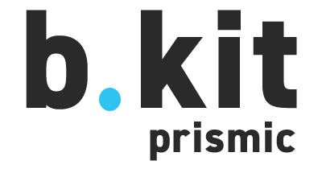

# b.kit Prismic

This package provides an interface to connect b.kit components with the Prismic CMS. To do so it defines slices that can be imported and used inside e.g. in a react nextjs project.

## Local Testing

Inside library project:

-   Install yalc globally: `yarn global add yalc`
-   Run `yalc publish` to publish library into local yalc store.
-   Run `yalc push` to push changes to all installations

Inside project that should use the library:

-   Run `yalc add <repository-name>` in target lokal repository to link library from yalc store.
-   Use `yalc update` or `yalc update <repository-name>` to update all linked packages.
-   use `yalc remove <repository-name>` to remove linked package.
-   use `yarn --check-files` afterwards to install packages from npm

    Before each push to git `yalc check` performs a check to ensure that all linked packages are removed from package.json. To delete package linking from package.json but not from yalc.lock `yalc retreat [--all]` / `yalc restore`

## FAQ

### Images in Prismic

-   SVG's are not supported by imgIx. Transforms are ignored! (e.g. `?w=`, `h=...` or `fm=` ... ) [more info](https://support.imgix.com/hc/en-us/articles/204280985#svg_s)
